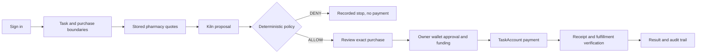

Floww connects an AI-selected purchase to user-approved spending limits, an exact Sepolia payment, and a traceable result.

# Floww by Web5

Floww는 AI가 선택한 구매를 사용자가 확인한 지출 조건, 정확한 테스트넷 결제, 확인 가능한 결과로 연결합니다.

The demonstration compares three simulated pharmacies. Kiln proposes a stored quote; deterministic policy checks the budget and allowed recipient; the user approves that exact purchase. A task-scoped account enforces the frozen terms. Payment and fulfillment are verified separately.

## Try and run

- [Client Preview](https://floww-client-demo-preview-geond.vercel.app/) — team access is required. The plain URL may show Vercel authentication. Request the team access link; no access token is published here.
- [Admin audit console](https://floww-admin-demo.vercel.app/) — a separately provisioned ADMIN account is required. A visible login page is not proof of an authenticated audit session.
- [Run the components](docs/START_HERE.md) — exact repositories, runtime prerequisites and setup links.
- [Architecture and API handoff](docs/ARCHITECTURE_DEMO_HANDOFF.md), [release manifest](release-manifest.json), [release checklist](docs/RELEASE_CHECKLIST.md).

## Purchase flow

Login is identity, not spending approval. The model cannot change recipients, budgets or authority. One business approval can require several wallet prompts for deployment, signature, allowance and funding. The three scenario routes and chat refer to the same server Task. Voice can request a scenario for on-screen confirmation; it cannot sign or pay.

## Recorded execution evidence

The following is an independently checked **locally hosted backend + scripted owner + public Sepolia** run on September 30 KST. It is not a claim that the current hosted frontend has passed a complete human-operated purchase. Simulated pharmacy fulfillment is not physical medicine delivery.

| Stage | Recorded result and public evidence |
| --- | --- |
| Task / account | Task `5665a02a-2300-4fab-866f-02a60ae57ead`; [TaskAccount](https://sepolia.etherscan.io/address/0x219e7bfB4C4788Fa2b35638957B53a6900bF0655) |
| Actual Kiln inference | `qwen3-32b` selected Pharmacy A; tool-call ID, generation ID and reported 974 tokens appear in the `model` object of the [machine record](https://github.com/web5five/Floww_Server/blob/6f1d3029885808bd35d706b47688b24166ed9273/docs/evidence/f031/sepolia-e2e-result.json). |
| Exact payment | 23.5 fUSDC = `23500000` base units; [payment transaction](https://sepolia.etherscan.io/tx/0x2e3110192ca84dbcafb5d6a0e925dd40cdd5fc5c700d161261afa10979281708). The receipt, PaymentExecuted and token Transfer were matched. |
| Fulfillment | [Reporter transaction](https://sepolia.etherscan.io/tx/0x8b6af8b662b87b86896e7179483da8fe94b11c60d6494fd20c6fc198f669ba60) records the matching simulated-fulfillment evidence hash before Task COMPLETED. |
| Denied attempt B | 64 fUSDC exceeds the 60 fUSDC Task cap: `BUDGET_EXCEEDED`. |
| Denied attempt C | Recipient outside the allowed set: `RECIPIENT_NOT_ALLOWED`. |
| Stops before payment | Both DENYs have null payment hashes, zero accounts/signed operations and unchanged public executor nonce. [DB evidence](https://github.com/web5five/Floww_Server/blob/6f1d3029885808bd35d706b47688b24166ed9273/docs/evidence/f031/sepolia-db-evidence.json). Local instrumented tests additionally assert zero broadcasts; public signing calls were not instrumented. |
| Recovery | The same payment ID/hash survived backend restart; reconciliation and repeated completion requests did not allocate another executor nonce. |

[Independent verification report: 55 checks, exact runtime/JAR identity and limitations](https://github.com/web5five/Floww_Server/blob/6f1d3029885808bd35d706b47688b24166ed9273/docs/F031_INDEPENDENT_SEPOLIA.md). The test token is faucet-enabled fUSDC on Sepolia, not Circle USDC or real money. ETH gas is separate from the fUSDC purchase cap.

## Implementation and acceptance

The server implements persisted Tasks/quotes, real Kiln proposals, policy checks, TaskAccount binding, approval, durable payment reconciliation and simulated fulfillment. The Client implements authentication gates, three scenarios, separate journey steps, same-Task chat/voice and recovery. The Admin implements role-gated, read-only audit routes. Sources and precise acceptance limits are pinned in the [manifest](release-manifest.json).

The [dated readiness observation](docs/evidence/2026-09-30/preview-readiness.md) preserves the earlier unauthenticated checks and newer hosted observations separately. Korean/English settings, scenario/chat and voice language merged in [Client PR #10](https://github.com/web5five/Floww_Frontend_Client/pull/10). Product Magic/MetaMask wallet choice and the common server sign-in path merged in [Client PR #11](https://github.com/web5five/Floww_Frontend_Client/pull/11) and were deployed to the protected stable Preview alias. The controller subsequently completed hosted Magic email OTP, Sepolia wallet/SIWE server login and navigation to `/pharmacy` on that alias; this is an observed **login and route-access slice**, not a hosted pharmacy purchase, wallet spending approval or full browser acceptance. Admin PR #8 is merged, while current authenticated Admin browser audit proof, hosted A/B/C completion and recovery remain open. The final video, selected deck and submission receipt are not yet published in this hub.

## Repositories

| Repository | Responsibility |
| --- | --- |
| [Floww](https://github.com/web5five/Floww) | Submission entry, component pins, public evidence and handoffs |
| [Floww_Frontend_Client](https://github.com/web5five/Floww_Frontend_Client) | Next.js user journey, wallet UI, chat and voice |
| [Floww_Server](https://github.com/web5five/Floww_Server) | Java 21 / Spring Boot, PostgreSQL / Flyway, Kiln, policy and execution |
| [Floww_SmartContract](https://github.com/web5five/Floww_SmartContract) | Solidity / Foundry task-scoped payment account |
| [Floww_Frontend_Admin](https://github.com/web5five/Floww_Frontend_Admin) | Next.js ADMIN-only audit console |

## Prior work and event work disclosure

This project uses open-source frameworks and SDKs including Next.js, React, Spring Boot, PostgreSQL, Foundry/OpenZeppelin and wallet SDKs. The Client includes the [Scaffold-ETH 2 wallet-toolkit attribution and adaptation record](https://github.com/web5five/Floww_Frontend_Client/blob/5003d0a49d3a6c46c1055b178a722e9815f37ad7/docs/F033A_SCAFFOLD_ETH_NOTICE.md). These dependencies are not team-original code.

Earlier PAIVERA concepts and visual/planning references informed the work. The Client's [import worklog](https://github.com/web5five/Floww_Frontend_Client/blob/5003d0a49d3a6c46c1055b178a722e9815f37ad7/docs/worklogs/client-2-import.md) explicitly records that it was developed locally with Codex assistance before its repository import; an import date must not be treated as the date all code was authored. We do not claim that every concept, asset or line began at the event. The recorded September 29–30 Floww integration includes the Task/quote/Kiln path, wallet authentication, canonical TaskAccount binding, payment/recovery/fulfillment and Client/Admin integration. Component histories and linked PRs preserve the scope and chronology. Exact organizer-defined pre-event boundaries and any additional pre-existing material require the team's final disclosure review before submission.

## Team

| Participant | Area |
| --- | --- |
| Michael | Product and architecture |
| Ria Choi | Backend and shared API |
| Taeheon Choi | Blockchain and TaskAccount |
| Sinwoo Park | Frontend and user experience |
| Geondong Kim | AI/Kiln, integration, verification, wallet/Admin and language/voice |

See [contribution workflow](CONTRIBUTING.md). This repository is a public project hub, not a final contest submission receipt.
