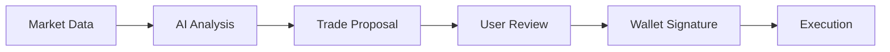

<div align="center">

# 🌊 Floww

### Smarter crypto trading starts with a better flow.

AI-powered crypto market analysis, built to help traders make clearer decisions.

[](https://github.com/web5five/Floww)
[](#project-status)

</div>

---

## ⚡ Quick Links

| Resource | Description |
|---|---|
| [🚀 Start Here](./docs/START_HERE.md) | Project overview and first steps |
| [🎬 Architecture & Demo Handoff](./docs/ARCHITECTURE_DEMO_HANDOFF.md) | System architecture and demo flow |
| [📦 Release Manifest & Checklist](./docs/RELEASE_MANIFEST_AND_CHECKLIST.md) | Release scope and readiness checklist |
| [🔌 API Contract](./docs/API_CONTRACT.md) | Backend and integration API details |
| [🧭 Technical Walkthrough](./docs/TECHNICAL_WALKTHROUGH.md) | Technical overview of the system |
| [🗂️ Issue #3](https://github.com/web5five/Floww/issues/3) | Hackathon integration tracking |
| [🤝 Contributing](./CONTRIBUTING.md) | How to contribute |

---

## 💡 What is Floww?

Floww is an AI-assisted crypto trading prototype that connects market analysis, trade proposals, and wallet-based execution into one guided experience.

The project explores how AI can help users understand market conditions and review a trade proposal before deciding whether to sign and execute it.

> **Floww helps users make informed decisions. It does not promise returns or provide guaranteed financial outcomes.**

---

## 🧭 The Flow



---

## 📍 Project Status

Floww is a hackathon build. The team is prioritizing an end-to-end purchase flow and integration between the backend, AI/Kiln, and wallet components.

The current project documentation distinguishes between verified component tests and a completed user purchase. Historical integration evidence includes:

- **F006:** 13 Java tests, 82 assertions, and 7 Docker checks; a real four-call Kiln conversation was recorded.
- **F010:** 60 Java/PostgreSQL tests and 15 HTTP checks; one actual Kiln HTTP proposal was recorded.

These are separate verification snapshots. They demonstrate component and integration progress, but **do not establish that a complete purchase flow has been completed**.

---

## 🧩 Repository Guide

| Repository area | What lives here |
|---|---|
| [`Floww_Server`](https://github.com/web5five/Floww_Server) | Backend API and server-side purchase flow |
| [`Floww`](https://github.com/web5five/Floww) | Project hub, shared documentation, and integration references |
| [`Floww Smart Contract`](https://github.com/web5five/Floww_SmartContract) | Smart Contract |
| [`Floww Client Frontend`](https://github.com/web5five/Floww_Frontend_Client) | Client Side Frontend |
| [`Floww Admin Frontend`](https://github.com/web5five/Floww_Frontend_Admin) | Admin Side Frontend |

---

## 👥 Participants

| Role | Participant | Focus |
|---|---|---|
| 🧭 Product & Architecture | Michael | Product direction, system architecture, and integration priorities |
| ⚙️ Backend & Core API | Choi Ria | Backend services, API contracts, and purchase-flow integration |
| 🧠 AI, Kiln & Evidence | Geondong Kim | AI proposal flow, Kiln integration, and verification evidence |
| ⛓️ Blockchain & Smart Account | Taehoon Choi | Wallet signing, smart-account, and blockchain integration |
| 🎨 Frontend & UX | Shinwoo Park | User experience, frontend flow, and interface integration |

---

## ✅ Integration Priorities

The team is connecting the core purchase flow end to end:

1. Create and process a Task and Mandate.
2. Retrieve pharmacy quotes.
3. Create an order from the selected quote.
4. Connect the AI/Kiln proposal flow.
5. Verify wallet signing and execution through the integration flow.

See the [API Contract](./docs/API_CONTRACT.md) and [Architecture & Demo Handoff](./docs/ARCHITECTURE_DEMO_HANDOFF.md) for the documented integration details and current acceptance evidence.

---

## 🛡️ Release Gates

Before presenting the flow as complete, verify that:

- The documented API contracts match the running implementation.
- Task, Mandate, quote, and order handling work through the intended path.
- AI/Kiln proposal behavior is connected to the backend flow.
- Wallet signing and execution evidence is available for the integrated path.
- The demo can be reproduced using the documented setup and handoff steps.

---

## 🧪 Verification Notes

Test counts and integration evidence are tied to the specific snapshots listed above. They should not be interpreted as proof that every component is currently passing or that a complete purchase has been executed.

Use the [Release Manifest & Checklist](./docs/RELEASE_MANIFEST_AND_CHECKLIST.md) for the current release scope and evidence requirements.

---

## 🚀 Getting Started

Start with the project guide:

```bash
git clone https://github.com/web5five/Floww.git
cd Floww
```

Then follow the setup instructions in [Start Here](./docs/START_HERE.md). The project hub links to the relevant repositories and integration documentation.

---

## 🤝 Contributing

Contributions and integration work are welcome. Please review the [Contributing Guide](./CONTRIBUTING.md), then use [Issue #3](https://github.com/web5five/Floww/issues/3) to track hackathon integration work.

---

<div align="center">

### Built with focus. Shipped with flow. 🌊

</div>
